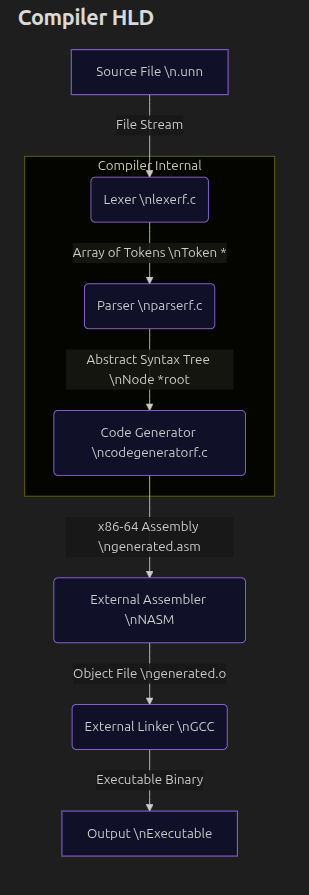
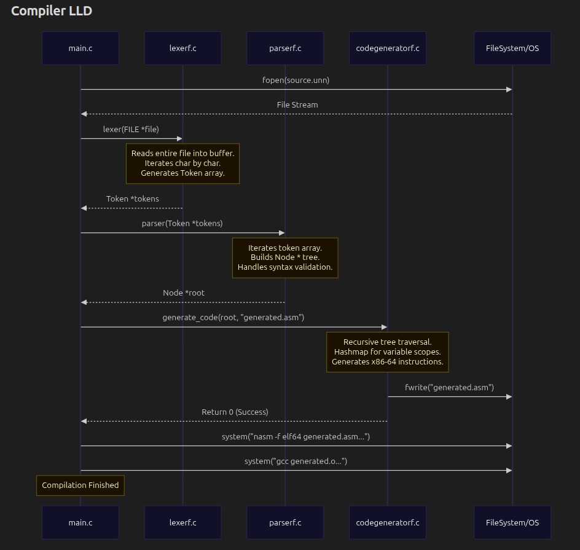

# Compiler Design Schematics

A programming language compiler built using C. Implementing Parser, Lexer, Code Generator, and Assembler.

---

## High-Level Design (HLD)

The compiler follows a traditional multi-pass architecture. It breaks down the compilation process into distinct phases, each handled by a dedicated module. 

### System Architecture Pipeline

The main execution flow (`main.c`) coordinates these phases:

1. **Source Code Input:** The compiler reads a `.unn` source file.
2. **Lexical Analysis (Lexer):** Converts the raw string of characters into an array of meaningful tokens.
3. **Syntax Analysis (Parser):** Processes the token array to construct an Abstract Syntax Tree (AST), representing the logical structure of the code.
4. **Code Generation:** Traverses the AST to produce target-specific assembly code (x86-64).
5. **Binary Generation:** Shells out to external tools (`nasm` and `gcc`) to assemble and link the generated assembly into a final executable.

### HLD Data Flow Diagram



---

## Low-Level Design (LLD)

The LLD dives into the specific data structures and algorithmic approaches used within each major compiler phase.

### 1. Lexical Analyzer (`lexerf.c`)

**Responsibility:** Scan the source text and convert it into a sequence of classified tokens.
**Data Structure:** `Token` struct containing a `TokenType` enum (INT, KEYWORD, SEPARATOR, OPERATOR, IDENTIFIER, STRING, COMP, etc.), a string `value`, and a `line_num`.

**Data Flow & Logic:**
- The lexer reads the entire file into memory as a single string buffer.
- A `while` loop iterates through the string character by character (`current_index`).
- Conditional checks route the character to specific generator functions:
  - `generate_number()`: Extracts consecutive digits.
  - `generate_keyword_or_identifier()`: Extracts alphabetic strings and checks against predefined keywords (`exit`, `int`, `if`, `while`, `write`, `eq`, `neq`, etc.).
  - `generate_string_token()`: Extracts characters enclosed in quotes `""`.
  - `generate_separator_or_operator()`: Matches symbols like `{`, `}`, `(`, `)`, `;`, `+`, `-`, `=`, etc.
- Tokens are stored in a dynamically resizing array, terminated by an `END_OF_TOKENS` token.

### 2. Syntax Analyzer (`parserf.c`)

**Responsibility:** Validate the syntax of the token sequence and build an Abstract Syntax Tree (AST).
**Data Structure:** `Node` struct containing a `value`, `TokenType`, and pointers to `left` and `right` child Nodes.

**Data Flow & Logic:**
- The parser iterates over the `Token *` array, building the AST top-down starting with a root node `PROGRAM`.
- It uses a `curly_stack` (an array-based stack) to keep track of nested block scopes (`{` and `}`).
- Based on the current token type (usually a `KEYWORD` like `INT`, `IF`, `WHILE`, `EXIT`, `WRITE`), the parser branches into specific handler functions:
  - `create_variables()`: Parses variable declarations and assignments (e.g., `int x = 5;`). Builds left-leaning subtrees for variables and handles mathematical expressions via `generate_operation_nodes()`.
  - `create_if_statement()` / `generate_if_operation_nodes()`: Builds comparison nodes and scopes for conditional execution.
  - `handle_write_node()`: Handles stdout printing operations.
- The resulting structure is a binary tree where internal nodes represent operations/structures and leaf nodes represent values/identifiers.

### 3. Code Generator (`codegeneratorf.c`)

**Responsibility:** Translate the AST into x86-64 NASM assembly code.
**Data Structures:** 
- **Hashmap:** Used to track variables and their corresponding stack positions within the current scope.
- **Stacks:** `current_stack_size` (tracks variable stack offsets) and `curly_stack` (tracks nested loops/if statements to generate correct jump labels).

**Data Flow & Logic:**
- Traverses the AST recursively via `traverse_tree()`.
- Emits x86-64 instructions to an output `.asm` file.
- **Variable Management:** When a new variable (`INT`) is declared, its stack offset is saved in the `hashmap`. When out of scope (a `}` node is processed), variables declared within that scope are removed from the hashmap.
- **Expressions & Operators:** Operators trigger `generate_operator_code()`, which recursively evaluates the left and right children, pushing results to the CPU stack and popping them into registers (`rax`, `rbx`, `rdx`) for arithmetic operations (`add`, `sub`, `div`, `mul`).
- **Control Flow:** `IF` and `WHILE` nodes generate assembly labels (`label%d`, `loop%d`) and compare/jump instructions (`cmp`, `je`, `jne`, `jge`, `jle`).
- **Syscalls & C Library:** Uses Linux syscall `60` for `EXIT` and links against the C library to call `printf` for `WRITE` operations.

### LLD Component Interactions Schematic




Quick Start:

Dependencies: gcc, nasm

```
./build.sh
./build/unn <filename> <output_filename>
```
